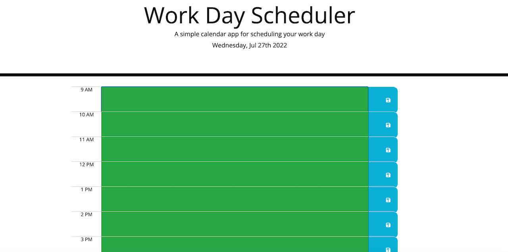

# work-day-scheduler

## Description

The project is to create a simple calendar application that allows a user to save events for each hour of the day by modifying starter code. This app will run in the browser and feature dynamically updated HTML and CSS powered by jQuery.

This app uses moment.js to use date and time.

## Table of Contents
* [Installation](#installation)
* [Usage](#usage)
* [License](#license)
* [Tests](#tests)
* [Deployed Site](#deployed)
* [Contact](#contact)

## Installation 
No installation needed. 

## Usage 
The project is to create a simple calendar application that allows a user to save events for each hour of the day by modifying starter code. This app will run in the browser and feature dynamically updated HTML and CSS powered by jQuery. 
Please view deployed Git Hub [URL](https://github.com/jayita87/work-day-scheduler)

## License 
This project is license under MIT

## Tests
There are no tests for this application.

## Deployed
Code deployed at https://jayita87.github.io/work-day-scheduler/.

## Contact
If you have any questions about this projects, please contact me directly at jayita.chowdhury.1987@gmail.com. You can view more of my projects at https://github.com/jayita87.
